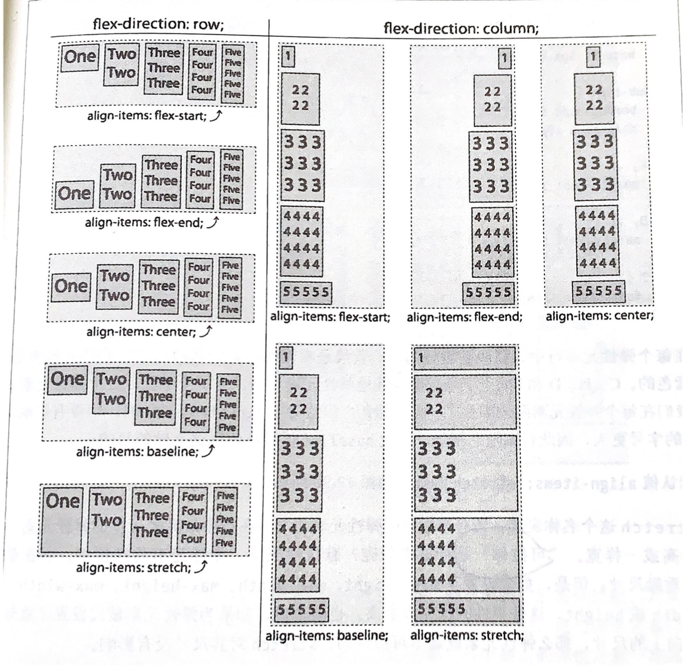
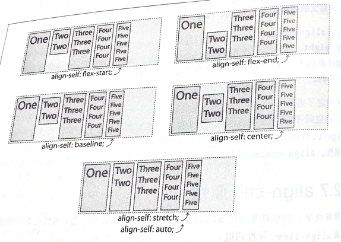
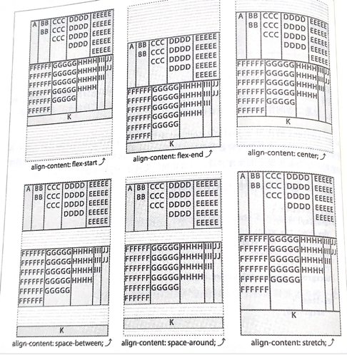

## Q1：什么是弹性盒布局？
- 特点：让元素对不同屏幕尺寸和不同显示设备做好适应。在响应式网站表现较好。

## Q2：display:flex和display:inline-flex的作用
- 使容器变成弹性布局，为其子元素生成弹性格式化的上下文

## Q3：flex-direction
- 指定在弹性容器中如何摆放弹性元素
- row（横）、column（竖）
- 加上reverse会反转

## Q4：换行
- 当主轴不够放的时候
- flex-wrap：nowrap/wrap/warp-reverse（换行放上面还是下面）

## Q5：flex-flow 弹性流
- 用于定义主轴（row（横）、column（竖））和垂轴的方向（wrap/warp-reverse），以及允许弹性元素换行
- 等于flex-direction和flex-wrap的简写，默认就是横着不换行
- 用法：flex-flow：row wrap

### Q6：justify-content
- 控制主轴上如何分布弹性元素
- 

### Q7：align-item
- 控制垂轴上的对齐方式
- 轴线的计算是包括边界的
- 

### Q8：align-self
- 在单个元素的对齐方式上使用align-self进行覆盖
- 默认值auto会继承align-item属性
- 

### Q9：align-content
- 控制垂轴上如何分布弹性元素
- 
