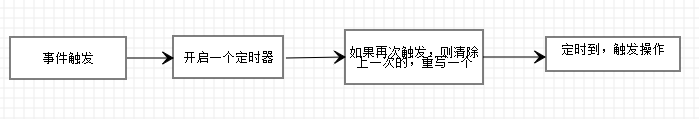

# vue2 技术复盘

### Q1：MVVM框架的理解？
- MVVM模型：
  - M：模型（Model），data中的数据
  - V：视图（View），模板代码
  - VM：视图模型（ViewModel），Vue实例
### Q2：和react的区别？
- 相同点：
  - 数据驱动视图
  - 组件化
  - Vue与React都使用了 Virtual DOM + Diff算法
- 不同点
  - vue的渐进式框架，进行数据拦截/代理，它对侦测数据的变化更敏感、更精确 。React推崇函数式编程（纯组件），数据不可变以及单向数据流
  - React推荐的做法是JSX + inline style, 也就是把 HTML 和 CSS 全都写进 JavaScript; Vue 推荐的做法是 template 的单文件组件格式。
- https://blog.csdn.net/m0_67401761/article/details/123399316
### Q3：插值语法和指令语法
- 插值语法：
  - 功能：用于解析标签体内容 ，写法：{{xxx}}，xxx是js表达式，且可以直接读取到data中的所有区域
- 指令语法： 
  - 功能：用于解析标签（包括：标签属性、标签体内容、绑定事件…）
  - 举例：< a v-bind:href="xxx">或简写为< a :href="xxx">，xxx同样要写js表达式，且可以直接读取到data中的所有属性
  - 备注：Vue中有很多的指令，且形式都是v-???，此处我们只是拿v-bind举个例子

### Q4: v-bind和v-model
- 单向绑定（v-bind）：数据只能从data流向页面
- 双向绑定（v-model）：数据不仅能从data流向页面，还可以从页面流向data
- 双向绑定一般都应用在表单类元素上（如：< input>、< select>、< textarea>等）
- v-model:value可以简写为v-model，因为v-model默认收集的就是value值

### Q5：el的两种写法
```javascript
// 写法1：
new Vue({
  el:'#root'
})
//写法2：挂载
vm.$mount('#root')
```
### Q6：data的两种写法
```javascript
// 写法1：对象式
data:{
  name:'JOJO'
}
```
```javascript
// 写法2：函数式（组件要用函数式）
data(){
  return{
    name:'JOJO'
  }
}
```
### Q7：数据代理

- Vue中的数据代理通过vm对象来代理data对象中属性的操作（读/写）
- Vue中数据代理的好处：更加方便的操作data中的数据
- 基本原理：
  - 通过object.defineProperty()把data对象中所有属性添加到vm上。
  - 为每一个添加到vm上的属性，都指定一个getter/setter。
  - 在getter/setter内部去操作（读/写）data中对应的属性。
### Q8：事件处理
- 使用v-on:xxx或@xxx绑定事件，其中xxx是事件名
- 事件的回调需要配置在methods对象中，最终会在vm上
- methods中配置的函数，==不要用箭头函数！==否则this就不是vm了
- methods中配置的函数，都是被Vue所管理的函数，this的指向是vm或组件实例对象
- @click="demo和@click="demo($event)"效果一致，但后者可以传参
```javascript
<button v-on:click="showInfo1">点我提示信息1</button>
<button @click="showInfo2($event,66)">点我提示信息2</button>

methods:{
  showInfo1(event){
    console.log(event)
  },
  showInfo2(evnet,num){
    console.log(event,num)
  }
}
```
### Q9：事件修饰符
- prevent：阻止默认事件（常用）
- stop：阻止事件冒泡（常用）
  - 【注】事件冒泡
    - 当我们点击页面某个元素时，会产生点击事件，事件由外到内，逐层递进,当目标元素捕捉到目标事件时，会响应事件，并由内到外，逐层往外传递.
    
- once：事件只触发一次（常用）
- capture：使用事件的捕获模式
  - 冒泡是从里往外冒，捕获是从外往里捕。
  - 当捕获存在时，先从外到里的捕获，剩下的从里到外的冒泡输出。
  - 参考博客：https://blog.csdn.net/catascdd/article/details/108273931
- self：只有event.target是当前操作的元素时才触发事件
- passive：事件的默认行为立即执行，无需等待事件回调执行完毕
  - passive主要用在移动端的scroll事件，来提高浏览器响应速度，提升用户体验。
  因为passive=true等于提前告诉了浏览器，touchstart和touchmove不会阻止默认事件，手刚开始触摸，浏览器就可以立刻给与响应；否则，手触摸屏幕了，但要等待touchstart和touchmove的结果，多了这一步，响应时间就长了，用户体验也就差了。

### Q10：键盘事件
```javascript
<input type="text" placeholder="按下回车提示输入" @keydown.enter="showInfo">
```
- Vue中常用的按键别名：
  - 回车：enter
  - 删除：delete (捕获“删除”和“退格”键)
  - 退出：esc
  - 空格：space
  - 换行：tab (特殊，必须配合keydown去使用)
  - 上：up
  - 下：down
  - 左：left
  - 右：right
- 注意：
  - 系统修饰键（用法特殊）：ctrl、alt、shift、meta
  - 配合keyup使用：按下修饰键的同时，再按下其他键，随后释放其他键，事件才被触发
  - 配合keydown使用：正常触发事件
  - 可以使用keyCode去指定具体的按键，比如：@keydown.13="showInfo"，但不推荐这样使用
  - Vue.config.keyCodes.自定义键名 = 键码，可以自定义按键别名

### Q11：计算属性
```html
姓：<input type="text" v-model="firstName"><br><br>
名：<input type="text" v-model="lastName"><br><br>
姓名：<span>{{fullName}}</span>
```
```javascript
//写法1：完整版
computed:{
  fullName:{
    get(){
      return this.firstName + '-' + this.lastName
    },
    set(value){
      const arr = value.split('-')
      this.firstName = arr[0]
      this.lastName = arr[1]
    }
  }
}
```
```javascript
//写法2：函数版（简写）
computed:{
    	fullName(){
		    return this.firstName + '-' + this.lastName
    	}
    }
```
总结：
- 定义：要用的属性不存在，需要通过已有属性计算得来。
- 原理：底层借助了Objcet.defineproperty()方法提供的getter和setter。
- get函数什么时候执行？
  - 初次读取时会执行一次
  - 当依赖的数据发生改变时会被再次调用
- 优势：与methods实现相比，内部有缓存机制（复用），效率更高，调试方便
- 备注：
  - 计算属性最终会出现在vm上，直接读取使用即可
  - 如果计算属性要被修改，那必须写set函数去响应修改，且set中要引起计算时依赖的数据发生改变
  - 如果计算属性确定不考虑修改，可以使用计算属性的简写形式

### Q12：监视属性
```html
<h2>今天天气好{{info}}!</h2>
<button @click="changeWeather">点击切换天气</button>
```
```javascript
// 写法1：
new Vue({
            el:'#root', 
            data:{ 
                isHot:true,
            },
            // 根据isHot的bool值决定显示什么文字
            computed:{
                info(){
                    return this.isHot ? '炎热' : '凉爽' 
                }
            },
            // 按钮点击改变isHot的值
            methods:{
				changeWeather(){
					this.isHot = !this.isHot
				}
			},
            // 监视isHot的值，要是改变了就输出
            watch:{
                isHot:{
                        immediate:true, //初始化时让handler调用一下
                        //handler什么时候调用？当isHot发生改变时
                        handler(newValue,oldValue){
                        console.log('isHot被修改了',newValue,oldValue)
                      }
                }
            }
        })
```
总结：
- 当被监视的属性变化时，回调函数自动调用，进行相关操作
- 监视的属性必须存在，才能进行监视
- 监视有两种写法：
- 创建Vue时传入watch配置

通过vm.$watch监视
```javascript
// 写法2：
vm.$watch('isHot',{
	immediate:true,
	handler(newValue,oldValue){
		console.log('isHot被修改了',newValue,oldValue)
	}
})
```
```javascript
// 写法3：简写。如果监视属性除了handler没有其他配置项的话，可以进行简写。
isHot(newValue,oldValue){
    console.log('isHot被修改了',newValue,oldValue,this)
}
```
### Q13：深度监视
```html
<h3>a的值是:{{numbers.a}}</h3>
<button @click="numbers.a++">点我让a+1</button>
<h3>b的值是:{{numbers.b}}</h3>
<button @click="numbers.b++">点我让b+1</button>
```
```javascript
new Vue({
            el:'#root', 
            data:{ 
                isHot:true,
                numbers:{
                    a:1,
                    b:1,
                }
            },
            watch:{
                //监视多级结构中所有属性的变化
                numbers:{
                    deep:true,
                    handler(){
                        console.log('numbers改变了')
                    }
                },
              
              //监视多级结构中某个属性的变化
              'numbers.a':{
                  handler(){
                      console.log('a被改变了')
                  }
              } 
            }
        })
```
总结：
- Vue中的watch默认不监测对象内部值的改变（一层）
- 在watch中配置deep:true可以监测对象内部值的改变（多层）

### Q14：computed和watch的不同
- 功能上：computed是计算属性，watch是监听一个值的变化，然后执行对应的回调。
- 是否调用缓存：computed中的函数所依赖的属性没有发生变化，那么调用当前的函数的时候会从缓存中读取，而watch在每次监听的值发生变化的时候都会执行回调。
- 是否调用return：computed中的函数必须要用return返回，watch中的函数不是必须要用return。
- computed默认第一次加载的时候就开始监听；watch默认第一次加载不做监听，如果需要第一次加载做监听，添加immediate属性，设置为true（immediate:true）
https://blog.csdn.net/web22050702/article/details/125530363

### Q15：样式绑定
- class样式：
  - :class="xxx"，xxx可以是字符串、对象、数组
  - 字符串写法适用于：类名不确定，要动态获取
  - 对象写法适用于：要绑定多个样式，个数不确定，名字也不确定
  - 数组写法适用于：要绑定多个样式，个数确定，名字也确定，但不确定用不用
- style样式：
  - :style="{fontSize: xxx}"其中xxx是动态值
  - :style="[a,b]"其中a、b是样式对象

### Q16：v-show和v-if
一、共同点：
v-if 和 v-show 都能实现元素的显示隐藏

二、区别：
1. v-show 只是简单的控制元素的 display 属性，而 v-if 才是条件渲染（条件为真，元素将会被渲染，条件 为假，元素会被销毁）；
2. v-show 有更高的首次渲染开销，而 v-if 的首次渲染开销要小的多；
3. v-if 有更高的切换开销，v-show 切换开销小；
4. v-if 有配套的 v-else-if 和 v-else，而 v-show 没有
5. v-if 可以搭配 template 使用，而 v-show 不行

三、v-show与v-if的使用场景
1. v-if 与 v-show 都能控制dom元素在页面的显示;
2. v-if 相比 v-show 开销更大的（直接操作dom节点增加与删除）
3. 如果需要非常频繁地切换，则使用 v-show 较好
4. 如果在运行时条件很少改变，则使用 v-if 较好
https://blog.csdn.net/weixin_58155690/article/details/125609235

### Q17：v-for
四种用法
- 数组：v-for="(item,index) in arr"
- 对象数组：v-for="item in objArr">
- 对象：v-for="(value,key,index) in obj"
- 整数：v-for="count in 10"
< li v-for="(item, index) in xxx" :key="yyy">，其中key可以是index，也可以是遍历对象的唯一标识

https://blog.csdn.net/qq_39055970/article/details/106308347?spm=1001.2101.3001.6661.1&utm_medium=distribute.pc_relevant_t0.none-task-blog-2%7Edefault%7ECTRLIST%7ERate-1-106308347-blog-124694828.pc_relevant_landingrelevant&depth_1-utm_source=distribute.pc_relevant_t0.none-task-blog-2%7Edefault%7ECTRLIST%7ERate-1-106308347-blog-124694828.pc_relevant_landingrelevant&utm_relevant_index=1

### Q18：v-for 中 key的原理
- 虚拟DOM中key的作用：key是虚拟DOM中对象的标识，当数据发生变化时，Vue会根据新数据生成新的虚拟DOM，
  随后Vue进行新虚拟DOM与旧虚拟DOM的差异比较，比较规则如下： 
  - 旧虚拟DOM中找到了与新虚拟DOM相同的key：若虚拟DOM中内容没变, 直接使用之前的真实DOM 
  - 若虚拟DOM中内容变了, 则生成新的真实DOM，随后替换掉页面中之前的真实DOM
  - 旧虚拟DOM中未找到与新虚拟DOM相同的key：创建新的真实DOM，随后渲染到到页面
- 用index作为key可能会引发的问题：
  - 若对数据进行逆序添加、逆序删除等破坏顺序操作(index会跟着改变)：会产生没有必要的真实DOM更新
  - 若结构中还包含输入类的DOM：会产生错误DOM更新，因为这部分的新旧dom代码一样，但是值不匹配。
- 开发中如何选择key?
  - 最好使用每条数据的唯一标识作为key，比如id、手机号、身份证号、学号等唯一值
  - 如果不存在对数据的逆序添加、逆序删除等破坏顺序的操作，仅用于渲染列表，使用index作为key是没有问题的
  
  

### Q19：Vue监视数据的原理
- vue会监视data中所有层次的数据
- 如何监测对象中的数据？
  - 通过setter实现监视，且要在new Vue时就传入要监测的数据
- 对象中后追加的属性，Vue默认不做响应式处理，如需给后添加的属性做响应式，请使用如下API：
  - Vue.set(target,propertyName/index,value)
  - vm.$set(target,propertyName/index,value)
- 如何监测数组中的数据？
  - 调用原生对应的方法对数组进行更新
  - 重新解析模板，进而更新页面
- 在Vue修改数组中的某个元素一定要用如下方法：
- 使用这些API：push()、pop()、shift()、unshift()、splice()、sort()、reverse()
  Vue.set() 或 vm.$set()
    1. push方法
    2. pop() 方法用于删除并返回数组的最后一个元素。
    3. shift() 方法用于删除数组的第一个元素，并返回第一个元素的值
    4. unshift() 方法可向数组的开头添加一个或更多元素，并返回新的长度。
    5. splice() 方法向/从数组中删除元素/插入元素/替换元素，然后返回被删除/插入/替换的项目。
    6. sort() 方法用于对数组的元素进行排序
    7. reverse() 方法用于颠倒数组中元素的顺序
       https://blog.csdn.net/qq_44185284/article/details/103613439?spm=1001.2101.3001.6661.1&utm_medium=distribute.pc_relevant_t0.none-task-blog-2%7Edefault%7ECTRLIST%7ERate-1-103613439-blog-121977857.pc_relevant_default&depth_1-utm_source=distribute.pc_relevant_t0.none-task-blog-2%7Edefault%7ECTRLIST%7ERate-1-103613439-blog-121977857.pc_relevant_default&utm_relevant_index=1
- 特别注意：Vue.set() 和 vm.$set() 不能给vm 或 vm的根数据对象（data等） 添加属性

### Q20: 表单
- 收集表单数据：
  - 若：< input type="text"/>，则v-model收集的是value值，用户输入的内容就是value值
  - 若：< input type="radio"/>，则v-model收集的是value值，且要给标签配置value属性
  - 若：< input type="checkbox"/>
  - 没有配置value属性，那么收集的是checked属性（勾选 or 未勾选，是布尔值）
  - 配置了value属性：
    - v-model的初始值是非数组，那么收集的就是checked（勾选 or 未勾选，是布尔值）
    - v-model的初始值是数组，那么收集的就是value组成的数组
  - v-model的三个修饰符：
    - lazy：失去焦点后再收集数据
    - number：输入字符串转为有效的数字
    - trim：输入首尾空格过滤
  
### Q21：过滤器
- 定义：对要显示的数据进行特定格式化后再显示（适用于一些简单逻辑的处理）。
- 语法：
  - 注册过滤器：Vue.filter(name,callback) 或 new Vue{filters:{}}
  - 使用过滤器：{{ xxx | 过滤器名}} 或 v-bind:属性 = "xxx | 过滤器名"
- 过滤器可以接收额外参数，多个过滤器也可以串联
- 并没有改变原本的数据，而是产生新的对应的数据


### Q22：v-text
- 作用：向其所在的节点中渲染文本内容

### Q23：v-html
- 向指定节点中渲染包含html结构的内容

### Q24：v-cloak指令
- 本质是一个特殊属性，Vue实例创建完毕并接管容器后，会删掉v-cloak属性，使用css配合v-cloak可以解决网速慢时页面展示出{{xxx}}的问题

### Q25：v-once指令：
- v-once所在节点在初次动态渲染后，就视为静态内容了
-以后数据的改变不会引起v-once所在结构的更新，可以用于优化性能

### Q26：v-pre指令：
- 跳过其所在节点的编译过程。
- 可利用它跳过：没有使用指令语法、没有使用插值语法的节点，会加快编译

### Q27：自定义指令
- 写法
  - 局部
    ```javascript
      new Vue({															
      directives:{指令名:配置对象/回调函数}   
      })
    ```
  - 全局
    ```javascript
    Vue.directive('fbind',{
    //指令与元素成功绑定时（一上来）
    bind(element,binding){
    element.value = binding.value
    },
    //指令所在元素被插入页面时
    inserted(element,binding){
    element.focus()
    },
    //指令所在的模板被重新解析时
    update(element,binding){
    element.value = binding.value
    }
    })
    ```
- 配置对象中常用的3个回调函数：
  - bind(element,binding)：指令与元素成功绑定时调用
  - inserted(element,binding)：指令所在元素被插入页面时调用
  - update(element,binding)：指令所在模板结构被重新解析时调用

### Q28:生命周期


### Q29：VueComponent
- school组件本质是一个名为VueComponent的构造函数，且不是程序员定义的，是Vue.extend生成的
- 我们只需要写<school/>或<school></school>，**Vue解析时会帮我们创建school组件的实例对象**，即**Vue帮我们执行的：new VueComponent(options)**
- 特别注意：每次调用Vue.extend，返回的都是一个全新的VueComponent！

### Q30：vc中的this指向：
- 组件配置中：data函数、methods中的函数、watch中的函数、computed中的函数 它们的this均是VueComponent实例对象
- new Vue(options)配置中：data函数、methods中的函数、watch中的函数、computed中的函数 它们的this均是Vue实例对象

### Q31: VueComponent.prototype.__proto__ === Vue.prototype

组件实例对象（vc）可以访问到 Vue 原型上的属性、方法


### Q32：ref属性：

- 被用来给元素或子组件注册引用信息（id的替代者）
- 应用在html标签上获取的是真实DOM元素，应用在组件标签上获取的是组件实例对象（vc）
- 使用方式：
  - 打标识：<h1 ref="xxx">yyy</h1> 或 <School ref="xxx"></School>
  - 获取：this.$refs.xxx
  - 输出：<h1>yyy</h1>，如果是组件，会输出VC

### Q33：props

- 功能：让组件接收外部传过来的数据

- 传递数据：<Demo :name="xxx"/>

- 接收数据：

  - 第一种方式（只接收）：props:['name']

  - 第二种方式（限制数据类型）：props:{name:String}
  - 第三种方式（限制类型、限制必要性、指定默认值）：

   ```
    props:{
        name:{
          type:String, //类型
            required:true, //必要性
            default:'JOJO' //默认值
        }
    }
   ```

- props是只读的，Vue底层会监测你对props的修改，如果进行了修改，就会发出警告，若业务需求确实需要修改，那么请复制props的内容到data中一份，然后去修改data中的数据


### Q34：mixin（混入)
功能：可以把多个组件共用的配置提取成一个混入对象

定义混入：

```javascript
const mixin = {
    data(){....},
    methods:{....}
    ....
}
```
使用混入：

```
全局混入：Vue.mixin(xxx)
局部混入：mixins:['xxx']
```

- 组件和混入对象含有同名选项时，这些选项将以恰当的方式进行“合并”，在发生冲突时以组件优先。
- 同名生命周期钩子将合并为一个数组，因此都将被调用。另外，混入对象的钩子将在组件自身钩子之前调用。

### Q35：scoped样式：

作用：让样式在局部生效，防止冲突

写法：`<style scoped>`

### Q36：webstorage

存储内容大小一般支持5MB左右（不同浏览器可能还不一样）

浏览器端通过Window.sessionStorage和Window.localStorage属性来实现本地存储机制

相关API：

1. xxxStorage.setItem('key', 'value')：该方法接受一个键和值作为参数，会把键值对添加到存储中，如果键名存在，则更新其对应的值

2. xxxStorage.getItem('key')：该方法接受一个键名作为参数，返回键名对应的值
3. xxxStorage.removeItem('key')：该方法接受一个键名作为参数，并把该键名从存储中删除
4. xxxStorage.clear()：该方法会清空存储中的所有数据

备注：

1. SessionStorage存储的内容会随着浏览器窗口关闭而消失
2. LocalStorage存储的内容，需要手动清除才会消失
3. xxxStorage.getItem(xxx)如果 xxx 对应的 value 获取不到，那么getItem()的返回值是null
4. JSON.parse(null)的结果依然是null

### Q37：自定义事件

1. 一种组件间通信的方式，适用于：==子组件 > 父组件

2. 使用场景：A是父组件，B是子组件，B想给A传数据，那么就要在A中给B绑定自定义事件（事件的回调在A中）

3. 绑定自定义事件：

   1. 第一种方式，在父组件中：<Demo @atguigu="test"/> 或 <Demo v-on:atguigu="test"/>
   2. 第二种方式，在父组件中：

```
<Demo ref="demo"/>
...
mounted(){
    this.$refs.demo.$on('atguigu',data)
}
```

4. 若想让自定义事件只能触发一次，可以使用once修饰符，或$once方法
5. 触发自定义事件：this.$emit('atguigu',数据)
6. 解绑自定义事件：this.$off('atguigu')
7. 组件上也可以绑定原生DOM事件，需要使用native修饰符
8. 注意：通过this.$refs.xxx.$on('atguigu',回调)绑定自定义事件时，回调要么配置在methods中，要么用箭头函数，否则this指向会出问题！

### Q38：全局事件总线（GlobalEventBus）：

- 一种组件间通信的方式，适用于任意组件间通信


```js
//安装全局事件总线：

new Vue({
   	...
   	beforeCreate() {
   		Vue.prototype.$bus = this //安装全局事件总线，$bus就是当前应用的vm
   	},
    ...

```

- 使用事件总线：

- 接收数据：A组件想接收数据，则在A组件中给$bus绑定自定义事件，事件的回调留在A组件自身`this.$bus.$on('xxx',this.demo)`

- 提供数据：`this.$bus.$emit('xxx',data)`

- 最好在`beforeDestroy`钩子中，用`$off`去解绑当前组件所用到的事件

### Q39：消息订阅

- 消息订阅与发布是一种组件间通信的方式，适用于任意组件间通信

- 使用步骤：

  - 安装pubsub：npm i pubsub-js

  - 引入：import pubsub from 'pubsub-js'


- 接收数据：A组件想接收数据，则在A组件中订阅消息`pubsub.subscribe('xxx',this.demo)`，订阅的回调留在A组件自身
- 提供数据：`pubsub.publish('xxx',data)`
- 最好在`beforeDestroy`钩子中，使用`pubsub.unsubscribe(pid)`取消订阅


### Q40：$nextTick

1. 语法：`this.$nextTick(回调函数)`
2. 作用：在下一次 DOM 更新结束后执行其指定的回调
3. 什么时候用：当改变数据后，要基于更新后的新DOM进行某些操作时，要在nextTick所指定的回调函数中执行


### Q41：Vue封装的过度与动画

- 作用：在插入、更新或移除 DOM元素时，在合适的时候给元素添加样式类名

- 写法：

- 元素进入的样式：

  v-enter：进入的起点
  v-enter-active：进入过程中
  v-enter-to：进入的终点

- 元素离开的样式：
  v-leave：离开的起点
  v-leave-active：离开过程中
  v-leave-to：离开的终点

- 使用<transition>包裹要过度的元素，并配置name属性：

```
<transition name="hello">
	<h1 v-show="isShow">你好啊！</h1>
</transition>
```

- 若有多个元素需要过度，则需要使用：<transition-group>，且每个元素都要指定key值

### Q42：slot插槽

有三种类型

默认插槽：在父组件中调用子组件，在子组件中插入结构，子组件中使用slot占位，父组件插入的结构会在子组件的slot里展示

```
父组件中：
        <Category>
           	<div>html结构1</div>
        </Category>
子组件中：
        <template>
            <div>
               	<slot>插槽默认内容...</slot>
            </div>
        </template>
```

具名插槽：使用方法同默认插槽，但需要写名字，子组件内使用name标识，在父组件中插入插槽元素需要使用template包裹，并在template中使用slot=名称，以适用对应的slot

```js
父组件中：
        <Category>
            <template slot="center">
             	 <div>html结构1</div>
            </template>

            <template v-slot:footer>
               	<div>html结构2</div>
            </template>
        </Category>
子组件中：
        <template>
            <div>
               	<slot name="center">插槽默认内容...</slot>
                <slot name="footer">插槽默认内容...</slot>
            </div>
        </template>
```

作用域插槽：数据在组件的自身，但根据数据生成的结构需要组件的使用者来决定

```js
//父组件
<li v-for="g in scopeData.games" :key="g">{{g}}</li>

//子组件
<slot :games="games"></slot>
data() {
      return {
               games:['红色警戒','穿越火线','劲舞团','超级玛丽']
               }
},

```


### Q43：vuex是什么？什么时候使用vuex？
- 专门在 Vue 中实现集中式状态（数据）管理的一个 Vue 插件，对 vue 应用中多个组件的共享状态进行集中式的管理（读/写），也是一种组件间通信的方式，且适用于任意组件间通信

- 当多个组件依赖于同一状态，来自不同组件的行为需要变更同一状态需要使用vuex

  

### Q44：Vuex的基本使用

操作：放在 src/store/index.js

当需要判断或者处理其他业务逻辑的时候放在`actions(context,value)`里，当处理完毕以后通过`context.commit('mutations名称',value)`把数据放到mutations里

mutations里进行对state里数据的操作，使用数据的时候需要state.数据名称

组件中读取vuex中的数据：`$store.state.数据名称`

```js
//引入Vue核心库
import Vue from 'vue'
//引入Vuex
import Vuex from 'vuex'
//应用Vuex插件
Vue.use(Vuex)
   
//准备actions对象——响应组件中用户的动作
const actions = {
    addOdd(context,value){
        console.log("actions中的addOdd被调用了")
        if(context.state.sum % 2){
            context.commit('ADD',value)
        }
    },
    addWait(context,value){
        console.log("actions中的addWait被调用了")
        setTimeout(()=>{
			context.commit('ADD',value)
		},500)
    },
}
//准备mutations对象——修改state中的数据
const mutations = {
    ADD(state,value){
        state.sum += value
    },
    SUBTRACT(state,value){
        state.sum -= value
    }
}
//准备state对象——保存具体的数据
const state = {
    sum:0 //当前的和
}
   
//创建并暴露store
export default new Vuex.Store({
    actions,
    mutations,
    state
})

```
在组件中使用，绑定方法，在方法中`this.$store.commit('方法名称',传的值)`
```
<template>
	<div>
		<h1>当前求和为：{{$store.state.sum}}</h1>
		<h3>当前求和的10倍为：{{$store.getters.bigSum}}</h3>
		<select v-model.number="n">
			<option value="1">1</option>
			<option value="2">2</option>
			<option value="3">3</option>
		</select>
		<button @click="increment">+</button>
		<button @click="decrement">-</button>
		<button @click="incrementOdd">当前求和为奇数再加</button>
		<button @click="incrementWait">等一等再加</button>
	</div>
</template>

<script>
	export default {
		name:'Count',
		data() {
			return {
				n:1, //用户选择的数字
			}
		},
		methods: {
			increment(){
				this.$store.commit('ADD',this.n)
			},
			decrement(){
				this.$store.commit('SUBTRACT',this.n)
			},
			incrementOdd(){
				this.$store.dispatch('addOdd',this.n)
			},
			incrementWait(){
				this.$store.dispatch('addWait',this.n)
			},
		},
	}
</script>

<style>
	button{
		margin-left: 5px;
	}
</style>

```


### Q45：Vuex中的getter

概念：当`state`中的数据需要经过加工后再使用时，可以使用`getters`加工

在`store.js`中追加`getters`配置

组件中读取数据：`$store.getters.bigSum`

 ```
   ...
   const getters = {
   	bigSum(state){
   		return state.sum * 10
   	}
   }
   
   //创建并暴露store
   export default new Vuex.Store({
   	...
   	getters
   })
   
   
 ```

   

### Q46：Vuex中的map

mapState方法：用于帮助我们映射`state`中的数据，取代一个个写$store，在组件中直接当作组件内变量使用

```
computed: {
    //借助mapState生成计算属性：sum、school、subject（对象写法）
     ...mapState({sum:'sum',school:'school',subject:'subject'}),
         
    //借助mapState生成计算属性：sum、school、subject（数组写法）
    ...mapState(['sum','school','subject']),
},
```

mapGetters方法：用于帮助我们映射`getters`中的数据

```
computed: {
    //借助mapGetters生成计算属性：bigSum（对象写法）
    ...mapGetters({bigSum:'bigSum'}),

    //借助mapGetters生成计算属性：bigSum（数组写法）
    ...mapGetters(['bigSum'])
},
```

mapActions方法：用于帮助我们生成与`actions`对话的方法，即：包含`$store.dispatch(xxx)`的函数

```js
<button @click="组件内调用名称(n)">+</button>
methods:{
    //靠mapActions生成：incrementOdd、incrementWait（对象形式）
    ...mapActions({组件内调用名称:'vuex中的函数名称'})
}

```

mapMutations方法：用于帮助我们生成与`mutations`对话的方法，即：包含`$store.commit(xxx)`的函数

```js
<button @click="组件内调用名称(n)">+</button>
methods:{
    //靠mapActions生成：increment、decrement（对象形式）
    ...mapMutations({组件内调用名称:'vuex中的函数名称'}),
}
```


### Q47：Vuex中的命名空间

使用 const 名称来命名

读取的时候需要加上名称

```
const countAbout = {
	namespaced:true,//开启命名空间
	state:{x:1},
    mutations: { ... },
    actions: { ... },
  	getters: {
    	bigSum(state){
       		return state.sum * 10
    	}
  	}
}

const personAbout = {
  	namespaced:true,//开启命名空间
  	state:{ ... },
  	mutations: { ... },
  	actions: { ... }
}

const store = new Vuex.Store({
  	modules: {
    	countAbout,
    	personAbout
  	}
})

```

### Q48：Vue Router的基本使用

先需要创建一个路由文件，把组件的路由填写进来，`active-class`可配置高亮样式

`src/router/index.js`

```
//该文件专门用于创建整个应用的路由器
import VueRouter from "vue-router";
//引入组件
import Home from '../components/Home'
import About from '../components/About'

//创建并暴露一个路由器
export default new VueRouter({
    routes:[
        {
            path:'/about',
            component:About
        },
        {
            path:'/home',
            component:Home
        }
    ]
})

```

通过router-link 创建导航栏，使用router-view占位，当路由跳转以后会在view里面展示

```
<router-link class="list-group-item" active-class="active" to="/about">
                        About
</router-link>

<router-view></router-view>
```

通过切换，“隐藏”了的路由组件，默认是被销毁掉的，需要的时候再去挂载

每个组件都有自己的`$route`属性，里面存储着自己的路由信息

整个应用只有一个router，可以通过组件的`$router`属性获取到


### Q48：Vue Router 中的多级路由

配置路由规则，使用children配置项

```
routes:[
	{
		path:'/about',
		component:About,
	},
	{
		path:'/home',
		component:Home,
		children:[ //通过children配置子级路由
			{
				path:'news', //此处一定不要写：/news
				component:News
			},
			{
				path:'message', //此处一定不要写：/message
				component:Message
			}
		]
	}
]

```

跳转：<router-link to="/home/news">News</router-link>


### Q49：Vue Router 中 query传参

两种传递参数方法

```
<!-- 写法1:跳转并携带query参数，to的字符串写法 -->
<router-link :to="/home/message/detail?id=666&title=你好">跳转</router-link>
				
<!-- 写法2:跳转并携带query参数，to的对象写法 -->
<router-link :to="{
	path:'/home/message/detail',
	query:{
		id:666,
    title:'你好'
	}
}">跳转</router-link>


```
接收参数
```
$route.query.id
$route.query.title
```

### Q50：Vue Router 中 命名路由

目的是为了简化路由的写法，不用直接写路径

```js
<!--简化前，需要写完整的路径 -->
<router-link to="/demo/test/welcome">跳转</router-link>

<!--简化后，直接通过名字跳转 -->
<router-link :to="{name:'hello'}">跳转</router-link>

<!--简化写法配合传递参数 -->
<router-link 
	:to="{
		name:'hello',
		query:{
		    id:666,
            title:'你好'
		}
	}"
>跳转</router-link>


{
	path:'/demo',
	component:Demo,
	children:[
		{
			path:'test',
			component:Test,
			children:[
				{
          name:'hello' //给路由命名
					path:'welcome',
					component:Hello,
				}
			]
		}
	]
}

```

### Q51：Vue Router 中 parms 传参

特别注意：路由携带params参数时，若使用to的对象写法，则不能使用path配置项，必须使用name配置！

```js
//路由写法
{
			component:Message,
			children:[
				{
					name:'xiangqing',
					path:'detail/:id/:title', //使用占位符声明接收params参数
					component:Detail
				}
			]
		}
//接收参数的其他写法
//props的第一种写法，值为对象，该对象中的所有key-value都会以props的形式传给Detail组件。
props:{a:1,b:'hello'}
//props的第二种写法，值为布尔值，若布尔值为真，就会把该路由组件收到的所有params参数，以props的形式传给Detail组件。
props:true
//props的第三种写法，值为函数
							props($route){
								return {
									id:$route.params.id,
									title:$route.params.title,
								}
							}


//组件写法
<!-- 跳转并携带params参数，to的字符串写法 -->
<router-link :to="/home/message/detail/666/你好">跳转</router-link>
<!-- 跳转并携带params参数，to的对象写法 -->
<router-link 
	:to="{
		name:'xiangqing',
		params:{
		   id:666,
            title:'你好'
		}
	}"
>跳转</router-link>

//获取数据
//方法1:
<li>消息编号：{{$route.params.id}}</li>
<li>消息标题：{{$route.params.title}}</li>
//方法2:
props:['id','title']

```

### Q52：Vue Router 浏览器的历史记录 

- 作用：控制路由跳转时操作浏览器历史记录的模式
- 浏览器的历史记录有两种写入方式：push和replace，其中push是追加历史记录，replace是替换当前记录。路由跳转时候默认为push方式
- 开启replace模式：<router-link replace ...>News< /router-link>

### Q53： Vue Router 编程式路由导航

- 作用: 不借助< router-link>实现路由跳转 让路由跳转更灵活，在router-link里填大配置，在编程式路由也可以填

- this.$router.push({}) 内传的对象与<router-link>中的to相同

- this.$router.replace({}) 替换当前页记录跳转

- this.$router.forward()前进

- this.$router.back() 后退

- this.$router.go(x) 指定步数跳转,当x为正数时,前进x步,当x为负数时,后退x步


### Q54： Vue Router 缓存路由

作用：让不展示的路由组件保持挂载，不被销毁

```vue
//缓存一个路由组件
<keep-alive include="News"> //include中写想要缓存的组件名，不写表示全部缓存
    <router-view></router-view>
</keep-alive>

//缓存多个路由组件
<keep-alive :include="['News','Message']"> 
    <router-view></router-view>
</keep-alive>
```

`activated`和`deactivated`是路由组件所独有的两个钩子，用于捕获路由组件的激活状态

具体使用：

-  `activated`路由组件被激活时触发
- `deactivated`路由组件失活时触发

### Q55： Vue Router 路由守卫

分类：全局守卫、独享守卫、组件内守卫

全局守卫

```
//全局前置守卫：初始化时执行、每次路由切换前执行
router.beforeEach((to,from,next)=>{
	console.log('beforeEach',to,from)
	if(to.meta.isAuth){ //判断当前路由是否需要进行权限控制
		if(localStorage.getItem('school') === 'atguigu'){ //权限控制的具体规则
			next() //放行
		}else{
			alert('暂无权限查看')
		}
	}else{
		next() //放行
	}
})

//全局后置守卫：初始化时执行、每次路由切换后执行
router.afterEach((to,from) => {
	console.log('afterEach',to,from)
	if(to.meta.title){ 
		document.title = to.meta.title //修改网页的title
	}else{
		document.title = 'vue_test'
	}
})
```

独享守卫：

```
beforeEnter(to,from,next){
	console.log('beforeEnter',to,from)
    if(localStorage.getItem('school') === 'atguigu'){
        next()
    }else{
        alert('暂无权限查看')
    }
}
```

组件内守卫：

```
//进入守卫：通过路由规则，进入该组件时被调用
beforeRouteEnter (to, from, next) {...},
//离开守卫：通过路由规则，离开该组件时被调用
beforeRouteLeave (to, from, next) {...},
```

### Q55： 路由器的两种工作模式

- 对于一个url来说，什么是hash值？—— #及其后面的内容就是hash值

- hash值不会包含在 HTTP 请求中，即：hash值不会带给服务器

- hash模式：

  - 地址中永远带着#号，不美观

  - 若以后将地址通过第三方手机app分享，若app校验严格，则地址会被标记为不合法

  - 兼容性较好

- history模式：

  - 地址干净，美观

  - 兼容性和hash模式相比略差

  - 应用部署上线时需要后端人员支持，解决刷新页面服务端404的问题

